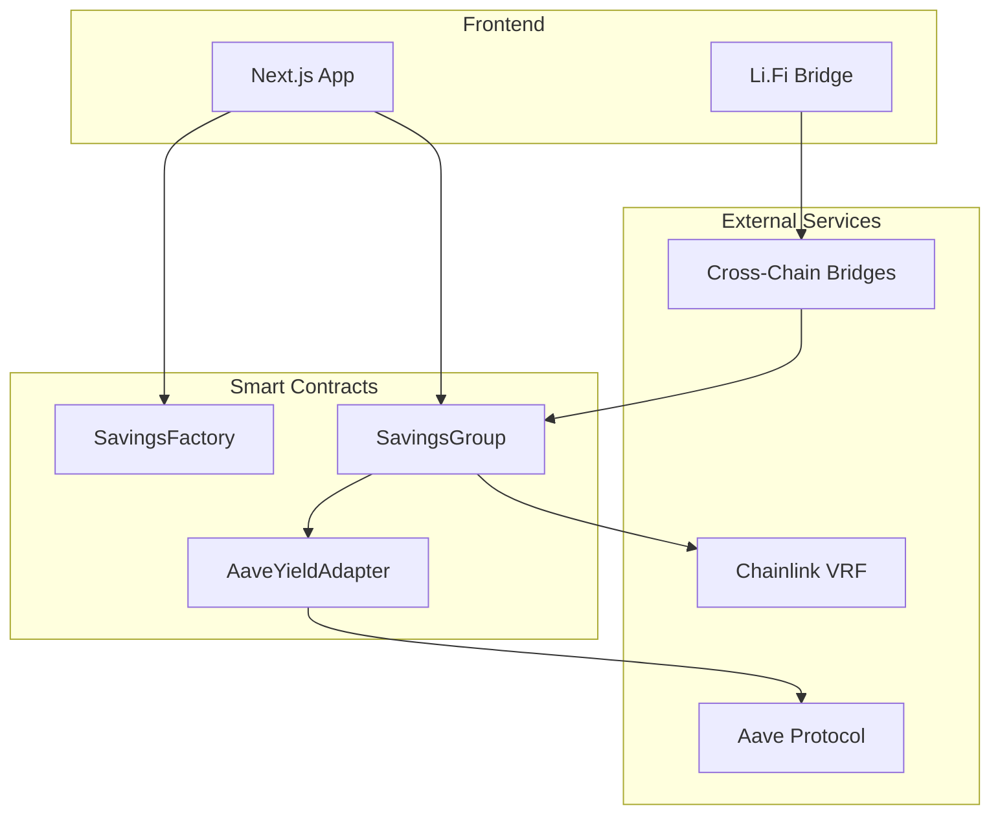
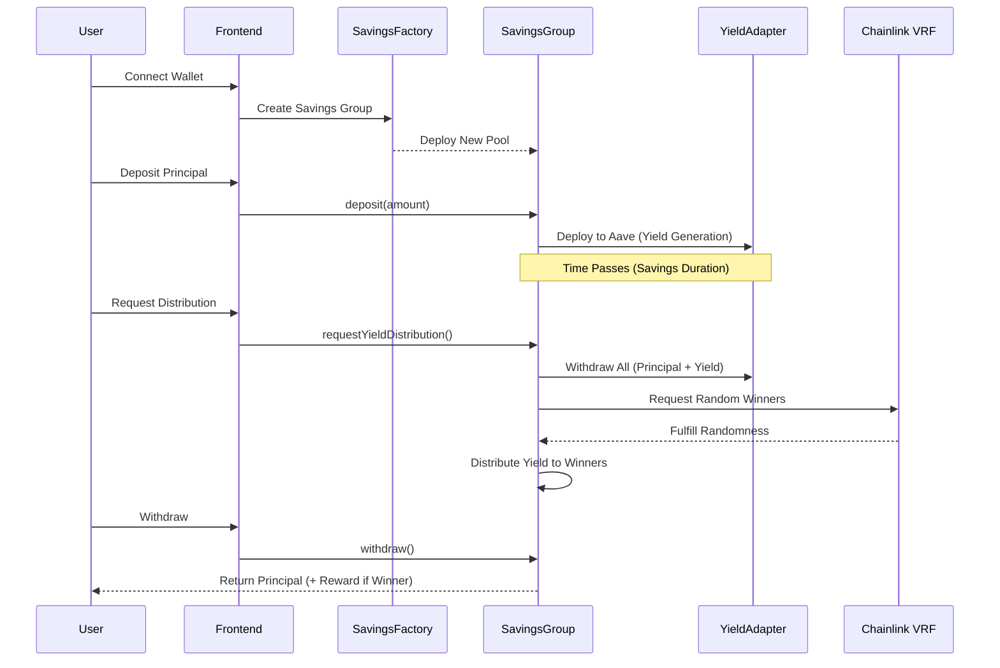

# Nectar 🍯


**Gamified Collective Savings Protocol with Cross-Chain Bridge Integration**

Nectar is a decentralized protocol that transforms traditional savings into an engaging, gamified experience. By pooling capital together, users generate collective yield through integrated DeFi protocols (like Aave). Instead of everyone receiving a small portion of interest, the yield is distributed to lucky winners selected via Chainlink VRF, while everyone's initial principal remains secure and withdrawable at any time.

[](https://opensource.org/licenses/MIT)
[](https://nextjs.org/)
[](https://soliditylang.org/)
[](https://chain.link/)

## 📑 Table of Contents

- [Overview](#overview)
- [Features](#features)
- [Architecture](#architecture)
- [Smart Contracts](#smart-contracts)
- [Frontend Application](#frontend-application)
- [Getting Started](#getting-started)
- [Usage](#usage)
- [Technology Stack](#technology-stack)
- [Security](#security)
- [Deployed Contracts](#deployed-contracts)
- [Contributing](#contributing)
- [License](#license)

## 🌟 Overview

Nectar reimagines decentralized savings by combining:
- **Collective Yield Generation**: Pool resources for better returns
- **Gamified Rewards**: Winners selected via provably fair randomness
- **Principal Protection**: Your deposit is always safe
- **Cross-Chain Accessibility**: Bridge from any chain using Li.Fi

## 🔑 Key Features

### Smart Contract Features
- ✅ **Principal Protection**: Your deposited capital is never at risk; only accumulated yield is distributed as rewards
- ✅ **Collective Yield Generation**: Leverage high-yield DeFi adapters (Aave) to maximize rewards
- ✅ **Provably Fair Selection**: Uses Chainlink VRF for unbiased winner selection
- ✅ **Flexible Groups**: Custom durations, member counts, and deposit goals
- ✅ **Modular Adapters**: Easy integration with different yield sources

### Frontend Features
- ✅ **Responsive Design**: Optimized for mobile, tablet, and desktop
- ✅ **Cross-Chain Bridging**: Li.Fi integration for bridging from any chain
- ✅ **Real-Time Updates**: Live pool stats and member information
- ✅ **3D Flip Cards**: Interactive pool cards with hover effects
- ✅ **Wallet Connection**: Reown AppKit (WalletConnect) integration

## 🏗 Architecture

### System Overview



### Protocol Workflow



---

## 📜 Smart Contracts

### Contract Architecture

```
contracts/
├── src/
│   ├── SavingsFactory.sol       # Factory for creating savings groups
│   ├── SavingsGroup.sol         # Core savings pool logic
│   ├── interfaces/
│   │   ├── ISavingsFactory.sol  # Factory interface
│   │   └── IYieldAdapter.sol    # Adapter interface
│   └── adapters/
│       └── AaveUsdcAdapter.sol  # Aave integration
└── test/
    └── SavingsGroup.t.sol       # Foundry tests
```

### 1. SavingsFactory.sol

**Purpose**: Entry point for creating new savings groups

**Key Functions**:
```solidity
function createGroupSingleYieldAdapter(
    SingleYieldInfo memory yieldInfo
) external returns (address);

function getAllGroups() external view returns (GroupInfo[] memory);

function getGroup(uint256 id) external view returns (GroupInfo memory);
```

**Features**:
- Deploy new savings groups
- Track all active groups
- Manage protocol fee wallet
- Emit `GroupCreated` events

### 2. SavingsGroup.sol

**Purpose**: Core contract for each savings pool

**Key Functions**:
```solidity
function deposit(uint256 amount) external;
function withdraw() external;
function requestYieldDistribution() external;
function getMembers() external view returns (address[] memory);
function getWinners() external view returns (address[] memory);
```

**Features**:
- User deposits and withdrawals
- Fund escrow and deployment to yield adapters
- Chainlink VRF integration for winner selection
- Yield distribution to winners
- Member and winner tracking

**State Variables**:
- `minDeposit` / `maxDeposit`: Deposit limits per user
- `minMembers` / `maxMembers`: Group size constraints
- `totalDepositGoal`: Target total deposits
- `winnersCount`: Number of winners to select
- `startTime` / `endTime`: Pool duration

### 3. AaveYieldAdapter.sol

**Purpose**: Interface for Aave protocol integration

**Key Functions**:
```solidity
function deposit(address token, uint256 amount) external;
function withdraw(address token, uint256 amount) external returns (uint256);
function getBalance(address token) external view returns (uint256);
```

**Features**:
- Supply USDC to Aave
- Withdraw principal + interest
- Query current balance
- Handle aToken conversions

### Smart Contract Setup

#### Prerequisites
```bash
# Install Foundry
curl -L https://foundry.paradigm.xyz | bash
foundryup
```

#### Installation
```bash
git clone https://github.com/Khemmie-Ray/Nectar.git
cd Nectar
forge install
```

#### Compile Contracts
```bash
forge build
```

#### Run Tests
```bash
forge test
forge test -vvv  # Verbose output
forge test --gas-report  # Gas usage report
```

#### Deploy Contracts
```bash
# Set environment variables
export PRIVATE_KEY=your_private_key
export RPC_URL=your_rpc_url

# Deploy
forge script script/Deploy.s.sol --rpc-url $RPC_URL --private-key $PRIVATE_KEY --broadcast
```

---

## 💻 Frontend Application

### Project Structure

```
frontend/
├── app/
│   ├── layout.tsx              # Root layout with providers
│   ├── page.tsx                # Homepage
│   ├── pools/
│   │   ├── page.tsx            # Pools listing
│   │   └── [id]/
│   │       └── page.tsx        # Pool details
│   └── globals.css             # Global styles
├── components/
│   ├── Header.tsx              # Navigation with wallet
│   ├── Hero.tsx                # Landing page hero
│   ├── BridgeModal.tsx         # Li.Fi bridge interface
│   └── AddressDisplay.tsx      # Address display component
├── hooks/
│   └── useLiFiBridge.ts        # Bridge integration hook
├── config/
│   └── index.tsx               # Wagmi configuration
├── context/
│   └── index.tsx               # App providers
└── abi/
    ├── SavingsFactory.json     # Factory ABI
    └── GroupSavings.json       # Pool ABI
```

### Tech Stack

#### Core Framework
- **Next.js 16.1.6** - React framework with App Router
- **React 19** - UI library
- **TypeScript 5** - Type safety

#### Web3 Integration
- **Wagmi 2.14.12** - React hooks for Ethereum
- **Viem 2.45.1** - TypeScript Ethereum library
- **@reown/appkit 1.8.17** - Wallet connection (WalletConnect)
- **@lifi/sdk** - Cross-chain bridge aggregator

#### Styling & UI
- **Tailwind CSS 4** - Utility-first CSS
- **Framer Motion** - Animation library
- **Lucide React** - Icon library

#### Additional Features
- **ENS Integration** - Ethereum Name Service support
- **Li.Fi Bridge** - Cross-chain token bridging
- **Next.js Image** - Optimized image loading

### Frontend Setup

#### Prerequisites
```bash
node >= 18.x
npm >= 9.x
```

#### Installation

```bash
# Clone repository
git clone https://github.com/Khemmie-Ray/Nectar.git
cd Nectar/frontend  # or Nectar-V2

# Install dependencies
npm install
```

#### Environment Variables

Create `.env.local`:
```env
NEXT_PUBLIC_PROJECTID=your_reown_project_id
```

Get your Project ID from [Reown Cloud](https://cloud.reown.com)

#### Run Development Server

```bash
npm run dev
```

Open [http://localhost:3000](http://localhost:3000)

#### Build for Production

```bash
npm run build
npm start
```

### Key Features Implementation

#### 1. Cross-Chain Bridging (Li.Fi)

Bridge USDC from any chain to participate:

```typescript
import { useLiFiBridge } from '@/hooks/useLiFiBridge';

const { getQuote, executeBridge } = useLiFiBridge();

// Get quote
const route = await getQuote(
  fromChainId,    // e.g., 137 (Polygon)
  toChainId,      // Your target chain
  amount,         // USDC amount
  targetToken     // USDC address on target chain
);

// Execute bridge
await executeBridge(route);
```

**Files**:
- `hooks/useLiFiBridge.ts` - Bridge logic
- `components/BridgeModal.tsx` - Bridge UI

#### 2. Wallet Connection

Using Reown AppKit (WalletConnect):

```typescript
import { useAppKitAccount } from '@reown/appkit/react';

const { address, isConnected } = useAppKitAccount();
```

**Files**:
- `config/index.tsx` - Wagmi adapter config
- `context/index.tsx` - App providers
- `components/Header.tsx` - Connection UI

#### 3. Contract Interaction

Read and write to smart contracts:

```typescript
import { useReadContract, useWriteContract } from 'wagmi';
import SavingsFactoryABI from '@/abi/SavingsFactory.json';

// Read all pools
const { data: pools } = useReadContract({
  address: FACTORY_ADDRESS,
  abi: SavingsFactoryABI,
  functionName: 'getAllGroups',
});

// Create new pool
const { writeContract } = useWriteContract();

await writeContract({
  address: FACTORY_ADDRESS,
  abi: SavingsFactoryABI,
  functionName: 'createGroupSingleYieldAdapter',
  args: [poolInfo],
});
```

---

## 🚀 Usage

### For Users

#### 1. Connect Your Wallet
- Click "Connect Wallet" in the header
- Select your wallet (MetaMask, WalletConnect, etc.)
- Approve connection

#### 2. Bridge Tokens (Optional)
If you have USDC on another chain:
- Click "🌉 Bridge/Swap"
- Select source chain (Ethereum, Polygon, etc.)
- Enter amount
- Confirm bridge transaction
- Wait for tokens to arrive

#### 3. Join a Savings Pool
- Browse available pools
- Click on a pool card to view details
- Enter deposit amount
- Click "Join Group"
- Confirm transaction

#### 4. Wait for Yield Generation
- Your funds are automatically deployed to Aave
- Track yield accumulation in real-time
- View other members in the pool

#### 5. Claim Your Share
After the pool duration ends:
- Winners are selected via Chainlink VRF
- All members can withdraw their principal
- Winners receive principal + yield reward

### For Developers

#### Creating a New Pool

```typescript
const poolInfo = {
  name: "OASIS",
  yieldAdapter: AAVE_ADAPTER_ADDRESS,
  token: USDC_ADDRESS,
  startTime: Math.floor(Date.now() / 1000),
  duration: 30 * 24 * 60 * 60, // 30 days
  winnersCount: 3,
  minDeposit: parseUnits("100", 6), // 100 USDC
  maxDeposit: parseUnits("2000", 6), // 2000 USDC
  minMembers: 5,
  maxMembers: 20,
  totalexpectedDepositPerUser: parseUnits("500", 6),
  totalDepositGoal: parseUnits("10000", 6),
  uri: "ipfs://...",
  additionalInfo: "0x",
};

await factory.createGroupSingleYieldAdapter(poolInfo);
```

#### Depositing to a Pool

```solidity
// Approve USDC first
await usdc.approve(poolAddress, amount);

// Deposit
await pool.deposit(amount);
```

#### Requesting Yield Distribution

```solidity
// Can only be called after endTime
await pool.requestYieldDistribution();
```

---

## 🔒 Security

### Smart Contract Security

- **Chainlink VRF**: Provably fair randomness for winner selection
- **OpenZeppelin**: Industry-standard libraries for security
- **Principal Protection**: Initial deposits always withdrawable
- **Reentrancy Guards**: Protection against reentrancy attacks
- **Access Control**: Role-based permissions

### Frontend Security

- **No Private Keys**: Never stores private keys
- **RPC Security**: Uses secure RPC endpoints
- **Input Validation**: Validates all user inputs
- **Type Safety**: Full TypeScript implementation

### Audits

> ⚠️ Smart contracts are currently unaudited. Use at your own risk. Audits planned for future releases.

---

## 📍 Deployed Contracts

### ARC Testnet

| Contract | Address | Explorer |
|----------|---------|----------|
| SavingsFactory | `0xE3b1AFA2e09AC4bFA417e118B43f0737C8803940` | [View](https://testnet.arcscan.app/address/0xE3b1AFA2e09AC4bFA417e118B43f0737C8803940) |
| AaveUsdcAdapter | `0x5F67925f67bb556a64e082D2eb88fc5D7De313CD` | [View](https://testnet.arcscan.app/address/0x5F67925f67bb556a64e082D2eb88fc5D7De313CD) |

---

## 🛠 Technology Stack

### Smart Contracts
- **Solidity ^0.8.0**
- **Foundry** - Development framework
- **OpenZeppelin** - Security libraries
- **Chainlink VRF** - Randomness
- **Aave V3** - Yield generation

### Frontend
- **Next.js 16** - React framework
- **TypeScript** - Type safety
- **Wagmi 2** - Ethereum interactions
- **Viem 2** - Low-level Ethereum library
- **Tailwind CSS** - Styling
- **Framer Motion** - Animations
- **Li.Fi SDK** - Cross-chain bridging

---

## 🤝 Contributing

We welcome contributions! Please follow these steps:

1. Fork the repository
2. Create a feature branch (`git checkout -b feature/amazing-feature`)
3. Commit your changes (`git commit -m 'Add amazing feature'`)
4. Push to the branch (`git push origin feature/amazing-feature`)
5. Open a Pull Request

### Development Guidelines

- Follow the existing code style
- Write tests for new features
- Update documentation
- Ensure all tests pass before submitting PR

---

## 📝 License

This project is licensed under the MIT License - see the [LICENSE](LICENSE) file for details.

---

## 👥 Team

Built with ❤️ by the Nectar team

- **GitHub**: [@Khemmie-Ray](https://github.com/Khemmie-Ray)
- **Twitter**: [@nectar_protocol](https://twitter.com/nectar_protocol)

---

## 🙏 Acknowledgments

- Chainlink for VRF infrastructure
- Aave for yield generation
- Li.Fi for cross-chain bridging
- OpenZeppelin for security libraries
- The Ethereum community

---

## 📞 Support

- **Documentation**: [docs.nectar.fi](https://docs.nectar.fi) (coming soon)
- **Discord**: [Join our community](https://discord.gg/nectar)
- **Twitter**: [@nectar_protocol](https://twitter.com/nectar_protocol)
- **Email**: support@nectar.fi

---

## 🗺 Roadmap

### Phase 1 (Current) ✅
- [x] Core smart contracts
- [x] Aave integration
- [x] Chainlink VRF integration
- [x] Frontend application
- [x] Li.Fi bridge integration

### Phase 2 (Q2 2025)
- [ ] Multi-chain deployment
- [ ] Additional yield adapters (Compound, Yearn)
- [ ] Mobile app
- [ ] Governance token
- [ ] DAO formation

### Phase 3 (Q3 2025)
- [ ] Smart contract audits
- [ ] Mainnet launch
- [ ] Liquidity mining
- [ ] Strategic partnerships
- [ ] Cross-chain pools

---

**Built for the future of decentralized savings 🍯✨**