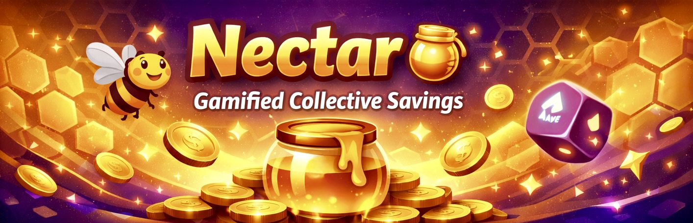
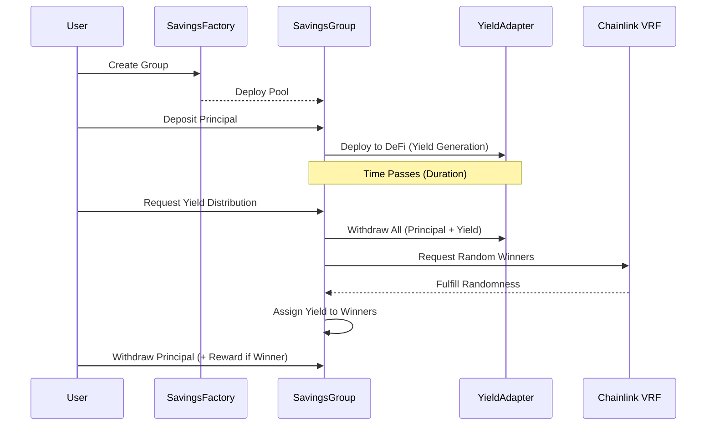
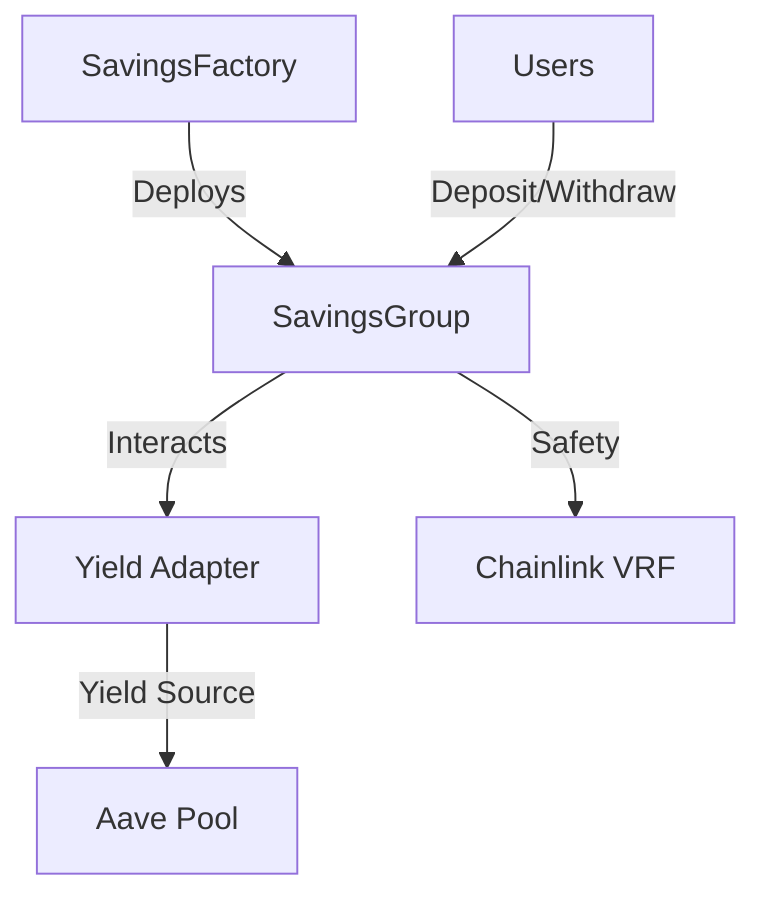

# Nectar 🍯



**Gamified Collective Savings Protocol**

Nectar is a decentralized protocol that transforms the traditional savings model into an engaging, gamified experience. By pooling capital together, users generate collective yield through integrated DeFi protocols (like Aave). Instead of everyone receiving a small portion of interest, the yield is distributed to lucky winners selected via Chainlink VRF, while everyone's initial principal remains secure.

## 🔄 Protocol Workflow



## 🚀 Key Features

- **Principal Protection**: Your deposited capital is never at risk; only the accumulated yield is distributed as rewards.
- **Collective Yield Generation**: Leverage high-yield DeFi adapters to maximize rewards.
- **Provably Fair Selection**: Uses Chainlink VRF to ensure unbiased winner selection.
- **Flexible Groups**: Create savings groups with custom durations, member counts, and deposit goals.
- **Modular Adapters**: Easily integrate with different yield sources (starting with Aave).

## 🏗 Architecture

The protocol consists of three main components:



### 1. [SavingsFactory.sol](src/SavingsFactory.sol)

The entry point for creating new savings groups. It manages protocol settings like fee wallets and tracks all active groups.

### 2. [SavingsGroup.sol](src/SavingsGroup.sol)

The core contract for each savings pool. It handles:

- User deposits and withdrawals.
- Escrowing funds and deploying them to yield adapters.
- Interacting with Chainlink VRF to select winners.
- Distributing yield rewards to winners.

### 3. [Yield Adapters](src/adapters/)

Standardized interfaces that allow `SavingsGroup` to interact with external DeFi protocols.

- **[AaveYieldAdapter.sol](src/adapters/AaveUdscAdapter.sol)**: Supplies assets to Aave and pulls them back with accrued interest.

## 🛠 Getting Started

### Prerequisites

- [Foundry](https://book.getfoundry.sh/getting-started/installation)

### Installation

```bash
git clone <repository-url>
cd nectar
forge install
```

### Compilation

```bash
forge build
```

### Testing

```bash
forge test
```

## 📖 Usage Flow

1. **Create a Group**: Use `SavingsFactory.createGroupSingleYieldAdapter` to deploy a new pool.
2. **Deposit**: Members join by calling `deposit(uint256 amount)` on the `SavingsGroup` contract before the `endTime`.
3. **Wait**: Funds are automatically deployed to generate yield.
4. **Distribute Yield**: Once the duration ends, call `requestYieldDistribution()`. This triggers the yield harvest and Chainlink VRF request.
5. **Withdraw Principal**: After yield distribution, all members can call `withdraw()` to retrieve their initial deposit. Winners will receive their principal plus the reward.

## 🛡 Security

- **Chainlink VRF**: Ensures the randomness used for winner selection is tamper-proof and verifiable.
- **OpenZeppelin**: Utilizes industry-standard libraries for access control and token handling.
- **Principal Integrity**: The protocol is designed to ensure that the initial deposit amount is always available for withdrawal once the period ends.

<!-- ## 📄 License

MIT -->
